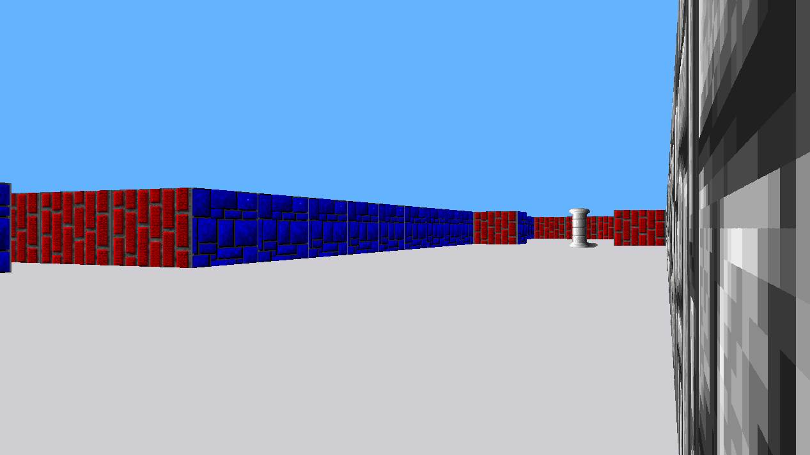
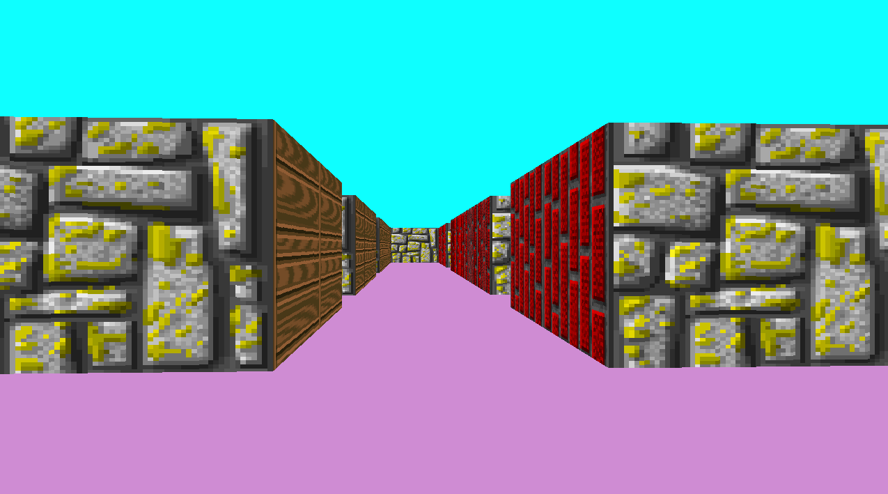

# Cub3D

**The goal of the projects is to create a “realistic” 3D graphical representation of the inside of a maze from a first person perspective. You have to create this representation using the _Ray-Casting_.**

**Цель проекта - создать "реалистичную" 3D проекцию лабиринта от первого лица. Это нужно сделать с помощью алгоритма проброски лучей, _Ray-Casting_.**

## Screenshots:

Use `make run` to launch with _maps/map3.cub_ map
> Should work both on MacOS and Linux. If you are unable to move, try changing key macroses in cub3d.h

## TODO:
**Done.**